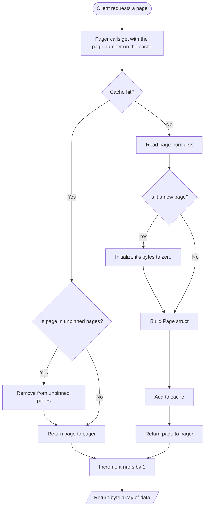
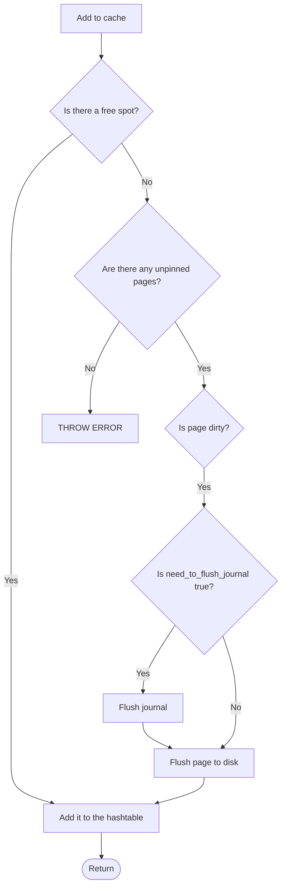
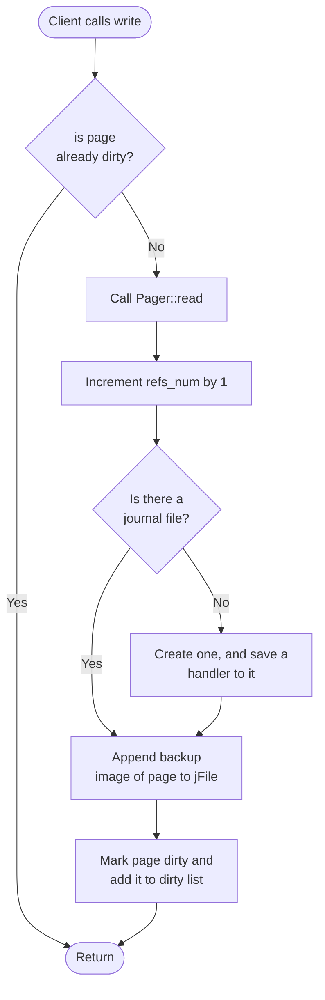
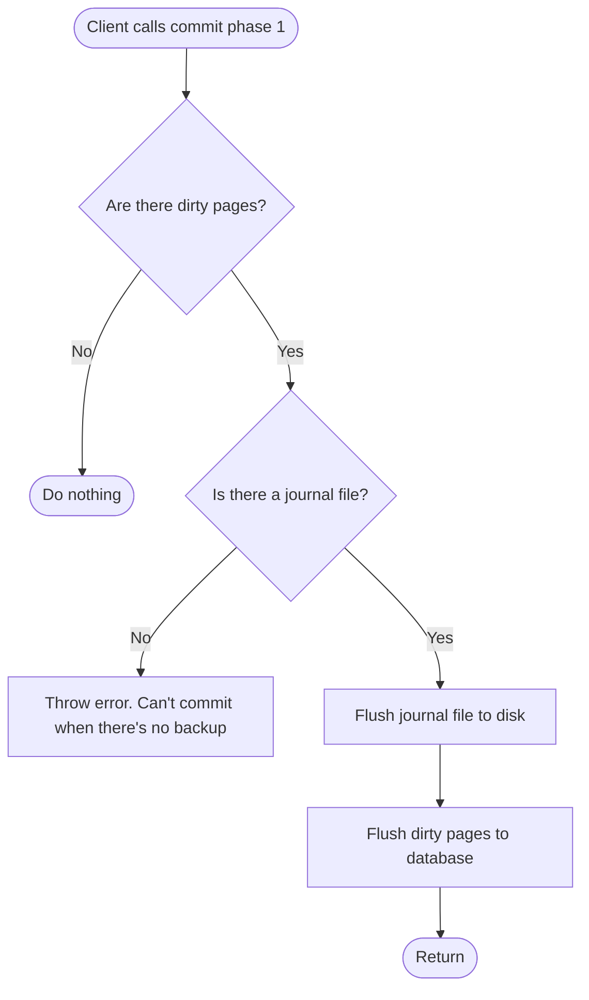
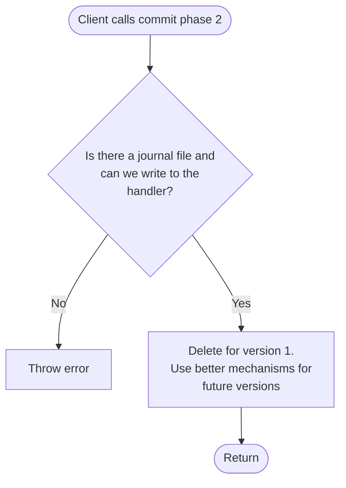

# Pager + Cache

## Version 1

## Data Structures & Interfaces

### Page struct

- We know that we are not taking up more than 4KB when loading from disk. We can just then allocate a static array for the data so it lives in the same block of contiguous memory as the page, instead of storing a pointer to another region in the heap and having to deal with allocations and frees. Hence, `char data[4096]`
- Bookkeeping fields: `page_num`, `refs_num` the number of transactions pinning down this page (actively using it).
- `is_dirty.` We need this for a couple of reasons. First of all, for bookkeeping in the case that we call `get` to read a page and for some reason want to check if it’s dirty or not. The other reason is for journaling purposes. A page that has been marked dirty means that we already have a backup of it in the journal, so no need to back it up again. The third reason is that during LRU Page eviction, it might happen that the victim page to evict happens to be a dirty page. If that’s the case, we need to flush it to disk, and possibly flush the journal too. We need a way to find that out quickly, and having a boolean flag for that is the easiest way.
- `need_flushing.` This tells us whether a dirty page still needs to participate in the next journal spill / phase-one flush. A page can remain dirty after phase one, but stop needing another flush until it is written again.

```cpp
struct Page {
	char data[4096];
	int page_num;
	int refs_num;
	bool is_dirty;
	bool need_flushing;
}
```

### PCache

- A general hash map for fast O(1) lookups to find a page object by its number.
- Unpinned_pages will be implemented as a doubly-linked list. Least recently used unpinned page will be at the forefront. Most recently will be at the tail. Will implement O(1) lookups with a hashmap that maps page numbers to nodes.
- Two methods: get and put. That’s it

```cpp
class PCache {
	private:
		static const DEFAULT_CAPACITY = 64;
		int capacity = DEFAULT_CAPACITY;
		int length = 0;
		std::unordered_map<int, Page *> cache_map;
		DLList *unpinned_pages = new DLList();
	public:
		PCache(): capacity(DEFAULT_CAPACITY) {};
		~PCache() {/* Should we free the pages if we are destructing the cache? */}
		Page *get(int page_num);
		Page *put(Page *page);
		int len();
}
```

### Pager

```cpp
class Pager {
	public:
		Pager();
		PagerResult open(std::string db_file);
		PagerGetResult get(int page_num);
		PagerResult begin_write(int page_num);
		PagerResult commit_phase_one();
		PagerResult commit_phase_two();
		PagerResult rollback_transaction();
		PagerResult rollback_hot_journal();
	private:
		enum class WriteTxnState : std::uint8_t {
			None = 0,
			DirtyInMemory,
			JournalDurable,
		};

		std::unordered_map<int, DirtyPageEntry *> dirty_pages;

		std::fstream dbFile_handler;

		std::string db_name;
		std::string jFile_name;
		PCache *pCache;
		WriteTxnState write_txn_state;
}
```

### DLList

```cpp
class DLList {
	private:
		struct Node {
			Node() {};
			Node(Page *page): page(page) {};
			Page *page = nullptr;
			Node *next = nullptr;
			Node *prev = nullptr;
		};
		std::unordered_map<int, Node *> nodesMap;
		int length = 0;
		Node *head;
		Node *tail;
	public:
		DLList() {/*Fill in*/};
		~DLList();
		void add(int page_num, Page *page);
		Page *get(int page_num);
		Page *remove(int page_num);
		bool exists(int page_num);
		int len();
}
```

## Invariants

- Only pages with `refs_num = 0` will be in unpinned_pages. Also, all pages with `refs_num = 0` will be in unpinned_pages.
- At any moment, `dirty_pages`  will hold pages that the client called write on. Doesn’t matter whether the client actually modified them or not. They will all have the `is_dirty` flag set too. Furthermore, any page that has `is_dirty` flag set will be in the `dirty_pages` .
- Before `Page::get` returns anything, we will ensure that the page is loaded in the cache.
- Before `Page::write` returns anything, we will ensure that the page is backed up in a journal file.
- `unpinned_pages` Will maintain a list of unpinned pages (under the hood, it’s a doubly-linked list with a hash map). The page at the very front of the list is the one that was least recently fully unpinned (i.e, `refs_num` = 0). Every time a page get fully unpinned, we add it to the tail of the list.
- No two `Page` objects will hold refs to the same page_num. NOT ALLOWED.
- Before phase one commit, every dirty page must have a corresponding rollback journal record in memory. After phase one commit, the journal is securely on disk.
- Before phase two commit, the journal is flushed to disk. After phase two commit, the dirty pages are flushed to disk and the journal is truncated. **Open question:** How do we ensure that the What
- `WriteTxnState::DirtyInMemory` means the current transaction can still be rolled back entirely from the pager's in-memory backup images.
- `WriteTxnState::JournalDurable` means this transaction has already crossed the durable-journal boundary, so abort must go through hot-journal recovery semantics rather than memory-only cleanup.

## State Transitions / Lifecycle

- `None -> DirtyInMemory` on the first successful `begin_write()` of a clean page.
- `DirtyInMemory -> JournalDurable` once phase one finishes making the rollback journal durable on disk.
- `JournalDurable` is sticky for the remainder of the transaction, even if the current dirty set later becomes empty because of cache spill.
- `rollback_transaction()` is the explicit local abort entrypoint:
  - if state is `DirtyInMemory`, it invalidates / restores the dirty cached pages from `backup_image`
  - if state is `JournalDurable`, it delegates to `rollback_hot_journal()`
- `rollback_hot_journal()` handles crash recovery and any abort path that already touched durable journal state on disk.

## Control Flow

### Reading a page when there’s enough capacity in the cache




### Handling full cache




### Writing to a page




### Phase 1 Commit




### Phase 2 Commit




## Edge cases to deal with

- Writes after phase 1 commit and before phase 2 commit
    - Solution: Throw an error if the dirty list is not empty on entry to phase 2. Phase 1 should write all dirty pages to disk and remove the dirty pages list.

## Backlog

- In the flow for reading a page— If the page is not in cache and we need to read from disk, we probably need to check if the cache can accommodate this read even to begin with. If not, we probably should throw a runtime error
- In the future, we should expand the cache temporarily if there isn’t a victim to evict.
- Journal header. Two phase flush for journal (first one for the log records, second one for the header). No need to do same for dirty pages.
- Database header. Need to also incorporate file-change counts in later versions of commits
- We haven’t really talked about Pager::open yet! What should we do when a database file doesn’t exist as opposed to when it exists? Need to also add branches to each of the other methods if there’s no database opened. Also implement Pager::close
-
