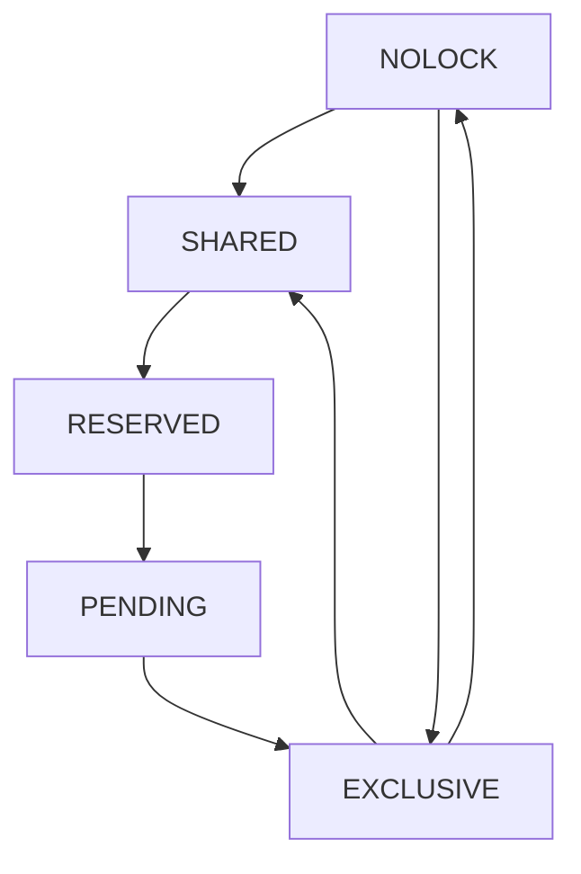

# Engine V2, Multiprocess coordination
At the time I'm writing this document, the first version of the pager is finished; A well-behaving client can now use the pager to write and read pages to a file on disk, with a crash-recovery guarantee. A benchmark test that I ran gave the following results (For a DB capped at 1000 pages):
- Sequential write: ~3000 pages/sec
- Sequential read: ~78k pages/sec
- Random read: ~77k pages/sec

The read throughput is better than what I was expecting. The write pitiful througput was expected; A write process has to make so many trips between the disk and memory: Write a journal header to disk, save a backup image of the full page on disk in a journal file, rewrite the header to the journal, ensure they are synced, then finally write the modified pages to disk, ensure they are synced. A lot of Disk I/O which is extremely slow and painful. It's definitely a point of optimization for the future. However, for now, we can claim that we achieved our goal of building a single-process pager that is crash-safe.

The next logical step is to make it multi-process safe through coordination and locking. Our first version of multi-process coordination will involve a very coarse locking scheme: Locks are held over the DB file. It's fully inspired by SQLite.

## Lock Types
- **NOLOCK**: The current process doesn't hold a lock on the database. Basically, a process that has this type of lock can't do reads nor writes.
- **SHARED**: The first level of privilege a process can hold on the DB file. This lock allows a process to only read pages from disk.
- **RESERVED**: The second level of privliege. Signals that this process intends to write in the future but is currently just reading. A process holding this lock can read and call `begin_write`. This type of lock prevents any other process from calling `begin_write`.
- **EXCLUSIVE**: The current process is actively in the first commit phase and writing to disk. A process holding this lock implies that there's no other process currently holding any type of lock on the DB.
- **PENDING**: A transitive lock between RESERVED and EXCLUSIVE. When a process wants to commit its changes (by calling `commit_phase_one`), the lock manager will try to upgrade to EXCLUSIVE right away. However, if there are processes currently holding the SHARED lock on the Database, it will upgrade to PENDING, which prevents new processes from trying to acquire a SHARED lock on the DB file. Then, once the last reader releases their SHARED lock, the lock manager will acquire the EXCLUSIVE lock and return to the pager

## Mapping Lock Types to OS primitive locks
The OS doesn't know anything about these types of locks. It only knows of read and write locks on a range of bytes. Therefore, to actually map our lock types to those primitves, we are going to have to use a combination of primitive locks.
We are going to designate the disk page starting at the offset 4GB as our lock-page. The first byte will be the `PENDING_BYTE`, the second byte will be the `RESERVED_BYTE`, and the third byte will be the `SHARED_BYTE`. Note that SQLite actually uses a range of bytes. for the shared portion. However, this is to handle some versions of Windows which only have write locks. Therefore, a shared lock will be just a write lock on a byte in that byte range, which obviously limits the number of concurrent readers on the DB file. For simplicity, we will only build this with the assumption it's running on linux. 
- **NOLOCK**: Neither a read nor a write lock is held on any of the bytes outlined
- **SHARED**: A read lock is acquired on the shared byte.
- **RESERVED**: A write lock is acquired on the reserved byte.
- **PENDING**: A write lock is acquired on the pending byte.
- **EXCLUSIVE**: A write lock is held on the shared byte.

## Lock acquisition state machine
Priviliges are aggregated during the lifecycle of a transaction, locks aren't. A transaction starts with a `NOLOCK` state and no priviliges. It then tries to upgrade itself to a `SHARED` state to acquire a read privilege. When it tries to write, it tries to acquire a `RESERVED` state lock. This gives it a write-in-memory privilige and prevents other processes from trying to write. Keep in mind it still has the read privilige. The lock was changed (upgraded, but the priviliges are aggregated). When it's ready to call the first phase of a commit, it tries to acquire `PENDING` state first (which is unknown to the caller. this is an internal state to the lock manager. The caller calls `acquire(EXCLUSIVE)` right away) by acquiring a write lock on `PENDING`. This state prevents new processes from trying to acquire a `SHARED` state on the DB. It then tries to acquire a write lock on the shared byte, which if successful, gives it a privilige to flush to disk all of its changes.
- **SHARED**: Acquire a read lock on the PENDING_BYTE, then a read lock on SHARED_BYTE, and release the PENDING_BYTE.
- **RESERVED**: Must already have a **SHARED** lock (aka, a read lock on the SHARED_BYTE). Acquire a write lock on the RESERVED_BYTE.
- **PENDING**: Must be already in **RESERVED** state (aka, a write lock on the RESERVED_BYTE and a read lock on the SHARED_BYTE). Acquire a write lock on the PENDING_BYTE
- **EXCLUSIVE**: This one is a little different. A process that just started and tries to open the DB file could jump right away to EXCLUSIVE. A process that was in PENDING state can jump to EXCLUSIVE once there are no more readers. So possible transitions NOLOCK -> EXCLUSIVE, PENDING -> EXCLUSIVE

Here's the state machine for clarity:

## Pager state machine integration
Before mapping individual functions, there are a couple of global rules that matter:
- The pager acquires `SHARED` on the first successful read access and keeps it until all page refs are released, unless it gets upgraded to a higher lock state in the meantime
- Any transition from `NOLOCK` to any other lock state must first acquire a stable lock state (`SHARED` or `RESERVED`) and only then refresh the DB header from disk. If the `file_change_counter` differs from the one currently cached in memory, the pager purges its page cache and updates the cached header before continuing
- Hot journal recovery can only happen either:
	- when a pager is opening the DB and still holds `NOLOCK`
	- when a pager is about to read from `NOLOCK`
	- when the pager is rolling back its own transaction while it already holds `EXCLUSIVE`
- The pager only asks the lock manager for a target lock state. Any intermediate transitions needed to get there are internal lock-manager logic, not pager logic

### `Pager::open`
- Required starting lock: NOLOCK, and !is_open
- Possible lock upgrade: `EXCLUSIVE` right away if there's a hot journal on disk and we need to rollback it before the pager becomes usable
- Resulting pager state if it succeds: Pager open, DB header loaded in memory, and DB file open with `NOLOCK` state
- Rollback path if it fails: Return the normal DBOpenFailed we already return

### `Pager::get`
- Required starting lock: Any lock
- Possible lock upgrade:
	- if current state is `NOLOCK` and a hot journal exists, upgrade right away to `EXCLUSIVE`, rollback it, downgrade back to `NOLOCK`, then continue with the normal read path
	- if current state is `NOLOCK`, request `SHARED` first, then refresh the header under that read privilege
	- if the pager still needs to read from disk, it already holds `SHARED`
- Resulting pager state if it succeds: Requested page is in cache and reffed. The pager holds at least `SHARED`
- Rollback path if it fails:
	- if lock acquisition fails, return Busy
	- if some other read/cache failure happens after acquiring `SHARED`, downgrade to the state that makes sense for the current ref counts. In practice, if this `get` did not successfully add a new ref and there are no outstanding refs, release back to `NOLOCK`

### `Pager::begin_write`
- Required starting lock: Any lock
- Possible lock upgrade:
	- if current state is `NOLOCK`, follow the same header refresh / hot journal recovery flow as `get` first
	- request `RESERVED`
- Resulting pager state if it succeds: The page is tracked by the normal begin_write flow and the pager holds at least `RESERVED`
- Rollback path if it fails:
	- if lock acquisition fails, return Busy
	- if the failure happens before the page is marked dirty and before any transaction state is created, downgrade to the state that matches the current ref counts
	- if the normal begin_write logic already dirtied pager state, keep the lock state consistent with that pager state rather than blindly downgrading

### `Pager::ref_page`
- Required starting lock: Any lock, but the page must already exist in cache
- Possible lock upgrade:
	- if current state is `NOLOCK`, request `SHARED` first and then refresh the header under that read privilege
- Resulting pager state if it succeds: The page ref count is incremented and the pager holds at least `SHARED`
- Rollback path if it fails:
	- if lock acquisition fails, return Busy
	- if the header refresh purges the stale cache entry, return `PageNotCached`
	- if ref increment fails for any other reason, do not keep a newly acquired `SHARED` lock unless some other page is still reffed

### `Pager::unref_page`
- Required starting lock: Any lock
- Possible lock upgrade: None
- Resulting pager state if it succeds:
	- the page ref count is decremented
	- if this drops the last outstanding ref and there is no active write transaction state, release all locks and go back to `NOLOCK`
	- if this drops the last outstanding ref but the pager is still in the middle of a write transaction, keep the current write lock state
- Rollback path if it fails: Return the normal error. No lock transition should happen if the page cannot be unreffed

### `Pager::allocate_page`
- Required starting lock: Any lock
- Possible lock upgrade:
	- if current state is `NOLOCK`, follow the same header refresh / hot journal recovery flow as `get` first
	- request `RESERVED` before mutating freelist state or appending a new page
- Resulting pager state if it succeds: A page number is allocated, the page is reffed, and the pager holds at least `RESERVED`
- Rollback path if it fails:
	- if lock acquisition fails, return Busy
	- if allocation fails before pager state becomes dirty, downgrade according to current ref counts
	- if allocation already dirtied pager state, keep the appropriate write lock and rely on the normal rollback path

### `Pager::free_page`
- Required starting lock: Any lock
- Possible lock upgrade:
	- if current state is `NOLOCK`, follow the same header refresh / hot journal recovery flow as `get` first
	- request `RESERVED` before mutating freelist pages or DB header fields
- Resulting pager state if it succeds: The page is linked into the freelist through the normal free-page flow and the pager holds at least `RESERVED`
- Rollback path if it fails:
	- if lock acquisition fails, return Busy
	- if the freelist mutation never started, downgrade according to current ref counts
	- if pager state is already dirty, keep the write lock state and rely on rollback

### `Pager::commit_phase_one`
- Required starting lock: Either RESERVED or EXCLUSIVE
- Possible lock upgrade: Request `EXCLUSIVE`. If the current state is only `RESERVED`, any intermediate `PENDING` behavior is handled internally by the lock manager
- Resulting pager state if it succeds: The pager holds `EXCLUSIVE`, the journal is durable on disk, and the rest of the current phase-one invariants hold
- Rollback path if it fails:
	- if the lock upgrade fails, return Busy and keep the transaction in its pre-phase-one write state
	- if the failure happens before the journal reaches the durable boundary and this call had not already inherited a durable journal from an earlier spill section, the pager may back down to its pre-phase-one write state
	- if the failure happens after the journal reaches the durable boundary, do not blindly downgrade. The pager must keep the lock state consistent with the fact that hot-journal recovery semantics now apply

### `Pager::commit_phase_two`
- Required starting lock: `EXCLUSIVE`
- Possible lock upgrade: None
- Resulting pager state if it succeds:
	- dirty pages are flushed to the DB file
	- the journal is truncated
	- if there are still pinned pages, downgrade to `SHARED`
	- if there are no pinned pages, release all locks and go back to `NOLOCK`
- Rollback path if it fails:
	- do not blindly release locks
	- the journal is already the source of truth for recovery at this point, so the pager must keep enough lock / transaction state for an explicit rollback or recovery path to finish safely

### `Pager::rollback_transaction`
- Required starting lock: Any lock
- Possible lock upgrade:
	- if the transaction is only dirty in memory, no upgrade is needed
	- if the transaction already crossed the durable-journal boundary, the pager should already be in `EXCLUSIVE` because it is rolling back its own write transaction after phase one started
- Resulting pager state if it succeds:
	- if rollback was memory-only, dirty in-memory pages are invalidated from the cache
	- if rollback used the durable journal, DB state is restored from the journal
	- after rollback finishes:
		- if there are still pinned pages, the pager downgrades to `SHARED`
		- otherwise it releases all locks and returns to `NOLOCK`
- Rollback path if it fails: Return the normal rollback error and keep the lock state consistent with however far rollback got

### `Pager::rollback_hot_journal`
- Required starting lock: Either `NOLOCK` or `EXCLUSIVE`
- Possible lock upgrade:
	- if called from `NOLOCK`, upgrade right away to `EXCLUSIVE`
	- if called while aborting our own transaction after phase one, it should already hold `EXCLUSIVE`
- Resulting pager state if it succeds:
	- the hot journal is replayed and finalized
	- if this was external recovery that started from `NOLOCK`, downgrade back to `NOLOCK`
	- if this was our own rollback and there are still pinned pages, downgrade to `SHARED`; otherwise downgrade to `NOLOCK`
- Rollback path if it fails: Return the normal journal recovery error and do not claim the pager is back in a clean `NOLOCK` state unless recovery actually finished

## Busy policy
- V2 will use a finite retry policy for lock acquisition instead of waiting forever
- The lock manager will retry at most `50` times before returning `Busy`
- Between retries, it will sleep for `1ms`
- The same retry policy applies whether the caller requested `SHARED`, `RESERVED`, or `EXCLUSIVE`
- If a process sees a hot journal from `NOLOCK` but cannot acquire `EXCLUSIVE` within the retry budget, it returns `Busy`
- If the retry budget is exhausted while trying to upgrade from `RESERVED` to `EXCLUSIVE` during `commit_phase_one`, it returns `Busy` and stays in the pre-phase-one write state

## Cache invalidation rules
- A cache purge is only considered when the pager is currently in `NOLOCK` and is about to transition to some other lock state
- After that stable lock is acquired, the pager reloads the DB header from disk and compares the on-disk `file_change_counter` against the in-memory one
- If the counters match, the pager keeps its current cache contents
- If the counters differ, the pager purges its cache, updates the cached DB header, and continues
- Purging the cache means:
	- remove every cached page object from `PCache`
	- clear any clean cached page that is no longer valid under the new DB image
	- invalidate the cached header page too, then repopulate header state from disk
- A pager in `NOLOCK` must have zero page refs, so cache purge from `NOLOCK` is always legal
- Dirty pages must never exist while the pager is in `NOLOCK`
- If the pager still has dirty in-memory state, it must still hold at least `RESERVED`

## Ref-count and lock invariants
- `NOLOCK` implies that the pager has zero outstanding page refs
- If the pager has one or more outstanding page refs, it must hold at least `SHARED`
- `unref_page()` is the operation that may release the last `SHARED` lock if the ref count drops to zero and there is no active write transaction
- `ref_page()` is still cache-only. From `NOLOCK` it may reacquire `SHARED`, but if header refresh purges the stale page out of cache it returns `PageNotCached` instead of loading from disk
- If a write transaction is active, dropping the last page ref does not automatically force the pager back to `NOLOCK`

## Hot journal detection and recovery rules
- For V2, a process first treats a journal as potentially hot if the journal file exists on disk and is not empty
- A pager only attempts external hot-journal recovery when it is currently in `NOLOCK`
- External recovery means:
	- request `EXCLUSIVE`
	- replay the journal
	- finalize the journal
	- downgrade back to `NOLOCK`
- If a process is rolling back its own write transaction after phase one already made the journal durable, it should already hold `EXCLUSIVE`; this is not external recovery
- While scanning the journal during recovery:
	- if the next bytes form a valid header, recover that sub-journal section normally
	- if the next bytes do not form a valid header, treat that point as the end of useful journal content
	- stop scanning, finalize the journal, and do not keep searching for more sections further ahead
- The reasoning is that in the crash model we care about, a corrupted header in the next position means the crashing process died while trying to start the next section, so there should not be another valid section after it

## Lock downgrade rules
- `commit_phase_two()`:
	- if there are pinned pages after the DB flush and journal truncation, downgrade from `EXCLUSIVE` to `SHARED`
	- if there are no pinned pages, release all locks and go to `NOLOCK`
- `rollback_transaction()`:
	- if rollback finishes and pinned pages still exist, downgrade to `SHARED`
	- otherwise release all locks and go to `NOLOCK`
- `rollback_hot_journal()`:
	- if it was external recovery that started from `NOLOCK`, always end in `NOLOCK`
	- if it was our own rollback while holding `EXCLUSIVE`, end in `SHARED` if pinned pages still exist, otherwise `NOLOCK`
- `unref_page()`:
	- if the last outstanding ref is released and there is no active write transaction, release all locks and go to `NOLOCK`
	- if a write transaction is still active, keep the current write lock state

## V2 Test Plan
### Unit tests
- `LockManagerStartsInNoLock`: Verifies a newly created lock manager reports `NOLOCK`
- `LockManagerAcquiresSharedFromNoLock`: Verifies a `NOLOCK -> SHARED` request succeeds when there is no contention
- `LockManagerAcquiresReservedFromNoLock`: Verifies requesting `RESERVED` lets the lock manager perform any internal steps and end in `RESERVED`
- `LockManagerAcquiresExclusiveFromNoLock`: Verifies requesting `EXCLUSIVE` from `NOLOCK` succeeds when no other process holds the DB
- `LockManagerDowngradesExclusiveToShared`: Verifies `unlock(SHARED)` from `EXCLUSIVE` keeps read privilege and releases write privilege
- `LockManagerUnlocksToNoLock`: Verifies `unlock(NOLOCK)` releases every lock byte
- `LockManagerRejectsIllegalDowngradeFromNoLock`: Verifies unlocking or downgrading from `NOLOCK` is handled as an invalid or no-op case according to the chosen API contract
- `LockManagerRetriesThenReturnsBusy`: Verifies finite retry behavior and final `Busy` result under contention
- `LockManagerPendingBlocksNewSharedReaders`: Verifies an exclusive upgrade path blocks new readers once the pending byte is held
- `LockManagerCurrentStateTracksTransitions`: Verifies `get_curr_state()` reflects each successful transition

### Integration tests
- `OpenRecoversHotJournalThenReturnsNoLock`: Verifies a newly opened pager performs external recovery and ends clean in `NOLOCK`
- `GetFromNoLockAcquiresSharedAndPinsPage`: Verifies the first `get()` from `NOLOCK` refreshes metadata, acquires read privilege, and returns a pinned page
- `LastUnrefReleasesSharedLock`: Verifies releasing the final page ref returns the pager to `NOLOCK` when no write transaction is active
- `BeginWriteRequestsReservedLock`: Verifies `begin_write()` transitions the pager into a write-capable state and blocks competing writers
- `SecondWriterReturnsBusyWhileReservedHeld`: Verifies a second process cannot begin a write while another process already holds `RESERVED`
- `CommitPhaseOneWaitsForReadersBeforeExclusive`: Verifies a writer cannot complete the exclusive upgrade while another process still holds active read refs
- `PendingStateBlocksNewReadersDuringExclusiveUpgrade`: Verifies new readers are blocked once a writer is in the exclusive-upgrade path
- `GetFromNoLockPurgesCacheWhenFileChangeCounterDiffers`: Verifies stale cached pages are dropped when another process committed changes
- `GetFromNoLockKeepsCacheWhenFileChangeCounterMatches`: Verifies the pager does not purge cache unnecessarily when the DB image is unchanged
- `AlreadyOpenPagerRecoversHotJournalBeforeRead`: Verifies a pager that previously returned to `NOLOCK` can recover another process's hot journal on the next `get()`
- `CommitPhaseTwoDowngradesToSharedWhenPagesRemainPinned`: Verifies a writer keeps read privilege after commit if the client still holds pinned pages
- `CommitPhaseTwoReleasesToNoLockWhenNoPagesPinned`: Verifies a writer fully releases locks after commit when no refs remain
- `RollbackTransactionInMemoryReleasesToNoLockWhenNoRefsRemain`: Verifies an in-memory rollback does not require durable recovery and returns to `NOLOCK` when possible
- `RollbackTransactionAfterPhaseOneUsesDurableJournal`: Verifies self-rollback after the durable boundary restores DB state correctly
- `RecoveryBusyIfExclusiveCannotBeAcquired`: Verifies external recovery returns `Busy` rather than pretending corruption when another process prevents exclusive access
